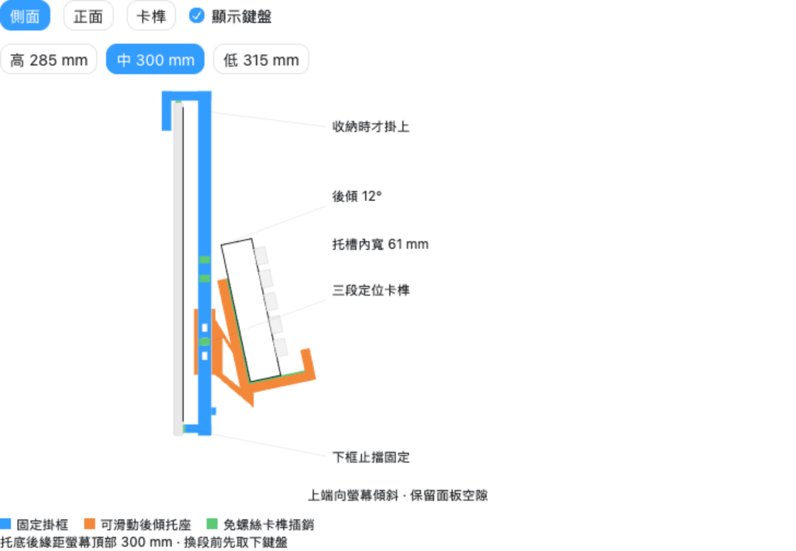
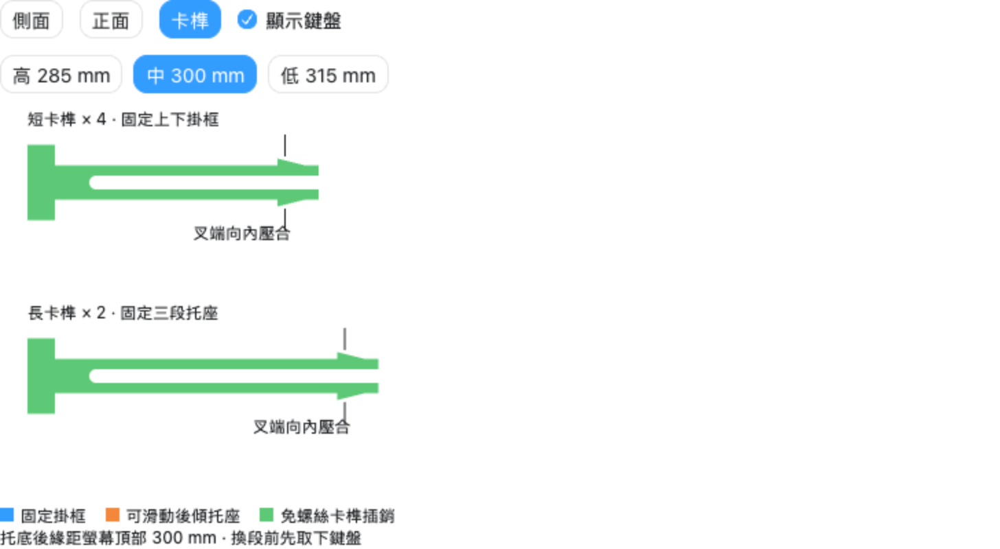

# Keyboard Holder — v0.4.0 試作版

可拆式螢幕前方鍵盤收納架，依 AOPEN 27HC5R 曲面螢幕與 Keychron V6 Max（V6M-D3）設計。收納時才掛上，鍵盤長邊水平、按鍵朝外；使用電腦前取下鍵盤與掛架。

本版把托座改為後傾 12°、61 mm 寬槽與 24 mm 前擋，並以列印卡榫插銷取代螺絲。托座有高、中、低三段；固定掛框的下方止擋始終對著螢幕實體下框。

**這是完成數位幾何檢查的試作版本，尚未實際列印、試掛或完成 PLA 長期承重及卡榫疲勞測試，沒有承重額定值。先印試配件，確認後再印整組。**

## 檔案

- [可修改的 OpenSCAD 設計](keyboard-front-hanger-v04.scad)：可調尺寸、角度、滑套間隙及插銷配合。
- [STL 列印檔](STL/)：13 種檔案，包含正式零件與試配件。
- [列印與組裝說明](列印與組裝說明.txt)：建議設定、裝配順序及試配方式。
- [幾何檢查紀錄](validation/mesh-validation.json)：各 STL 的封閉性、連通性、體積與尺寸。
- [三段干涉檢查](validation/geometry-checks.json)：名義尺寸下的交疊檢查結果。
- [檢查程式](validation/check_stl.py)：只需 Python 3 標準函式庫。

圖片是結構示意；螢幕底座、鍵帽排列與機身外觀未精確建模。加工尺寸以 SCAD 與 STL 為準。

## 尺寸與依據

| 項目 | 數值／狀態 |
| --- | --- |
| 螢幕機身高度，不含底座 | 使用者量測 355 mm |
| 掛鉤位置的上緣機身厚度 | 使用者量測 10 mm，左右約距中心 21 cm |
| 螢幕下方實體邊框高度 | 使用者量測 15 mm |
| 螢幕曲率 | 採 1500R 系列規格；實機後蓋輪廓仍須試配 |
| 鍵盤寬 × 深 | 官方 447.9 × 149 mm |
| 鍵盤重量 | 官方組裝重量 1110 ± 10 g，並非支架承重額定值 |
| 鍵盤厚度 | 使用者粗量 30 mm；未確定鍵帽包絡，因此預留 45 mm 設計包絡與寬槽 |
| 托槽硬壁間內寬 | 61 mm，沿垂直於鍵盤背面的方向量測，未扣軟墊 |
| 後傾角度 | 相對垂直線 12°，鍵盤上端朝螢幕 |
| 前擋／靠背高度 | 24／115 mm，沿傾斜靠背方向量測 |
| 高／中／低段 | 285／300／315 mm，相鄰相差 15 mm |
| 左右掛臂中心距 | 417.2 mm |
| 下框止擋 | 位於螢幕頂部下方 343–352 mm，接觸區高度 9 mm |

三段距離的基準為「螢幕機身頂部」到「托槽內底後緣」，未扣軟墊；不是前擋最高點或托架外部最低點。改段時只有托座移動，355 mm 的固定掛框長度不變。

軟墊從 2 mm 起試配。托槽多出的空間以固定在托座上的軟墊補足，讓鍵盤背面穩定貼靠；勿依靠壓住鍵帽定位。實際鍵帽、旋鈕、腳架與線材的突出部分仍須檢查。

## 列印數量

| STL | 正式組裝數量 | 用途 |
| --- | ---: | --- |
| `upper_left.stl`、`upper_right.stl` | 各 1 | 左右上掛框 |
| `lower_left.stl`、`lower_right.stl` | 各 1 | 左右下掛框與下框止擋 |
| `tray_left.stl`、`tray_right.stl` | 各 1 | 左右後傾托座 |
| `pin_joint.stl` | 4 | 上下掛框接合短插銷，每側 2 支 |
| `pin_tray.stl` | 2 | 托座定位長插銷，每側 1 支 |
| `coupon_joint.stl` | 試配 1 | 短插銷孔配合試片 |
| `coupon_rail.stl`、`coupon_slider.stl` | 試配各 1 | 滑動間隙與長插銷試片 |
| `top_fit_left.stl`、`top_fit_right.stl` | 試配各 1 | 兩側曲面掛鉤配合試片，不承重 |

正式組裝共 12 件列印零件，不需要金屬螺絲。短、長插銷可各多印 1 支備用。

## 列印與組裝摘要

1. 以 PLA 印試配件及兩種插銷，確認能插入、完全卡住、壓合叉端後退出；滑套能平順移動。再以掛鉤試片確認兩側後蓋與軟墊配合。
2. 正式件以 STL 原有方向、100% 比例列印。建議起始設定：0.4 mm 噴嘴、0.2 mm 層高、6 道外牆、6 層頂底、主件 50% 填充；插銷 100% 填充。實際設定依機器與材料調整。
3. 每個托座先從相對應下掛框的上端套入。選中段，對準孔，從左右外側各插入 1 支長插銷。
4. 將每側上下掛框的半搭接面相合，從外側插入 2 支短插銷。全部叉端須穿出並回彈，銷頭貼合外表面。
5. 在掛鉤接觸上緣與後蓋的位置、下框止擋、托槽內底與靠背貼軟墊。先離開螢幕做替代負載試驗，再空掛檢查接觸點與間距，最後扶住鍵盤緩慢放入。
6. 換段前先取下鍵盤，托住托座，壓合長插銷的兩個叉端並抽出；移至同一段後重新卡入。整組取下時，也先拿走鍵盤。

最長正式零件為 209.35 mm，設計可放入約 220 × 220 mm 的有效列印範圍，但仍須預留邊緣、裙邊及夾具空間。滑套有約 14.7 mm 內部橋接；請在切片預覽檢查橋接與懸空處，依機器能力使用可移除支撐。

卡榫採「可抽換的雙叉插銷」：銷身穿過框架承受剪力，叉端倒鉤防止退出。PLA 插銷若出現發白、裂紋、鬆動或無法回彈，應更換；不要靠硬掰或削去倒鉤完成裝配。完整細節見組裝說明。

## 已完成與未完成的驗證

- OpenSCAD 2026.10.02 匯出所有 13 種二進位 STL；每個檔案皆為單一連通實體、正體積，焊接至 0.00001 mm 後各邊由兩個面共用。
- 三段位置的掛框與托座、鍵盤包絡與支架、組件與理想曲面螢幕，均未測得正體積交疊；插銷銷頭只保留設計中的貼合面。這是名義尺寸幾何檢查，不包含列印變形、軟墊壓縮或承重變形。
- 預覽的三個觀看方向、三段切換與鍵盤顯示功能已檢查。
- 尚未切片實印、量測卡榫插拔力、試驗長時間負載、疲勞或驗證螢幕機殼與底座承受前方荷重的能力。使用前須確認螢幕不前傾，受力點皆為實體外框，硬件與鍵盤均不接觸顯示面板。

重新檢查 STL：在本資料夾執行 `python3 validation/check_stl.py`。

在 OpenSCAD 中選擇 `part` 可分別匯出零件；`stage` 0／1／2 對應高／中／低。`assembly` 用於查看組裝，不是整組一次列印的配置。若更改主要尺寸，應重新匯出並重做所有試配。

## 尺寸來源

- [Keychron V6 Max 官方規格](https://www.keychron.com/products/keychron-v6-max-qmk-via-wireless-custom-mechanical-keyboard?variant=40912031744089)：寬、深、重量與不含鍵帽的外殼高度。
- [Acer／AOPEN HC5 系列官方商品頁](https://store.acer.com/en-us/27-aopen-hc5-series-gaming-monitor-27hc5r-pbiipx)：27HC5R 系列 1500R 曲率參考。不同市場後綴不等同實機後蓋外形。
- 355／10／15 mm 以本次使用者量測為設計輸入；不是廠商完整機構圖。

版本日期：2026-10-03。v0.4.0 為後傾、卡榫與三段調整的首個上傳試作版。
